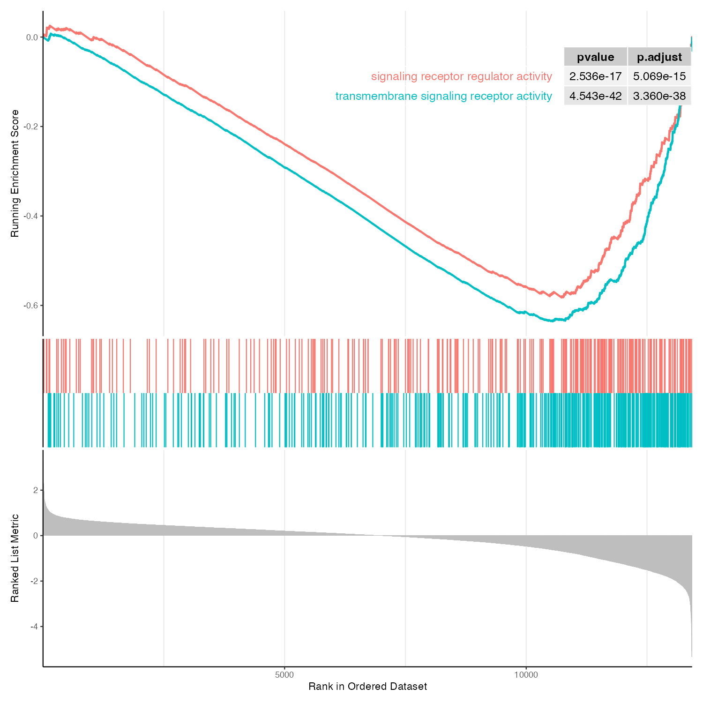

# Ifetroban Barcode Plots
Custom functions that can be leveraged for plotting GSEA results with the popular "Running Enrichment Score" plots (aka, barcode plots).

# Table of Contents
- [Introduction](#introduction)
- [Directories](#directories)
- [Files](#files)
- [Implementation](#implementation)


## Introduction
This code includes two wrapper functions that utilize the `gseaplot2` function from the popular GSEA package [clusterProfiler](https://bioconductor.org/packages/release/bioc/html/clusterProfiler.html) and [enrichplot](https://yulab-smu.top/biomedical-knowledge-mining-book/enrichplot.html)
The wrapper functions include basic plotting parameters that can be easily manipulated to further customize the plot.
Addtionally, the .rds objects for the GO and KEGG enrichment results are included, which enables the direct plotting with the default function `gseaplot2` from the `enrichplot` package.

This code requires the following packages be installed:

**1.** `clusterProfiler`

**2.** `enrichPlot`

**3.**  `org.Rn.eg.db`

**4.** `ggplot2`


To install these packages in R, simply run the following:
``` R
if (!require("BiocManager", quietly = TRUE))
    install.packages("BiocManager")

BiocManager::install("clusterProfiler")
BiocManager::install("enrichplot")
BiocManager::install("org.Rn.eg.db")
install.packages("ggplot2")
```

If prompted to update some/all/or no packages, type `a` in your RStudio terminal window to update all packages to allow compatibility.

## Directories
To use this code, clone this github repository in your working directory (whatever folder your R file is)

**1.** Enter your terminal

**2.** Navigate to your working directory using the `cd` command

**3.** Clone this repository to the working directory using the following code:


``` bash
# Run from within your working directory
pwd
cd /path/to/your/working_dir/
git clone https://github.com/mikemartinez99/Ifetroban
ls
```

Your directory structure should now be as follows:

**New_R_File.R is a file you need to create which is where you will call the functions to generate the plots. You can name it whatever you'd like!**
```
└── Working_Dir/
    ├── Ifetroban/
    │   ├── Code/
    │   │   └── GSEA_Barcode_Enrichment_Plots.R
    │   ├── Data/
    │   │   ├── TIfetroban_vs_TControl_gseGO.rds
    │   │   ├── TIfetroban_vs_TControl_gseKEGG.rds
    │   │   ├── Ifetroban_vs_TControl_GSEA_Input_List.csv
    │   │   └── Examples/
    │   │       ├── YourPlot.png
    │   │       └── YourPlot2.png
    │   └── README.md
    └── New_R_File.R
```
After successful repo cloning, you should have a folder called `Code`, `Data`, 'Examples`, and a 'README.md` file (of which you're reading)
You should stay in this working directory, and can create a new R file to generate your plots within this working directory and **NOT** within the Ifetroban folder.


# Files
Included in the repo:

**1.** TIfetroban_vs_TControl_gseGO.rds: The GO GSEA results

**2.** TIfetroban_vs_TControl_gseKEGG.rds: The KEGG GSEA results

**3.** TIfetroban_vs_TControl_GSEA_Input_List.csv: The master gene list used to generate both results


# Implementation
You can generate a multi-running enrichment score plot using the `plotESMulti` function, or generate a single running enrichment score plot using the `plotESSingle` function. Below are example usages for both!
The code below will show you how to source the code and call the functions to generate the plots. You will need to change the `wd` variable below, **ensuring that the path ends with a "/"**
If you cloned the github correctly and you are in the working directory which holds the Ifetroban repo folder, **you only need to change the `wd` varible, making sure to encase it in quotations, and leave every other path as it is!**

You can copy the code below directly into your R file which should live in your working directory and run it!

```R
#~~~~~~~~~~~~~~~~~~~~~~~~~~~~~~~~~~~~~~~~~~~~~~~~~~~~~~~~~~~~~~~~~~~~~~~~~~~~~~#
# LOAD LIBRARIES AND SET PATHS
#~~~~~~~~~~~~~~~~~~~~~~~~~~~~~~~~~~~~~~~~~~~~~~~~~~~~~~~~~~~~~~~~~~~~~~~~~~~~~~#

#----- Libraries
library(clusterProfiler)
library(org.Rn.eg.db)
library(ggplot2)
library(enrichplot)

#----- Set path to working directory
wd <- "Path/to/your/workingDirectory/"

#----- Set path to source code, input directory, and output path which we will create
sourceCode <- paste0(wd, "Ifetroban/Code/GSEA_Barcode_Enrichment_Plots.R"
inputDir <- paste0(wd, "Ifetroban/Data/")
outputDir <- paste0(wd, "Outputs")

#----- Data paths
go <- paste0(inputDir, "TIfetroban_vs_TControl_gseGO.rds")
kegg <- paste0(inputDir, "TIfetroban_vs_TControl_gseKEGG.rds")

#----- Generate the output Directory
if (!dir.exists(outputDir)) {
    dir.create(outputDir)
}

#----- Source the functions
source(sourceCode)
```
Now we need to read in the rds file that holds the GO or KEGG data. Once we load in the object, we can also save the results to a dataframe so you can easily parse the terms you want to extract in an excel like format. Once the dataframe is loaded in your environment, you can view it by clicking on it in your environment panel, or by running the `view` command

```R
#~~~~~~~~~~~~~~~~~~~~~~~~~~~~~~~~~~~~~~~~~~~~~~~~~~~~~~~~~~~~~~~~~~~~~~~~~~~~~~#
# READ IN THE GO OR KEGG DATA
#~~~~~~~~~~~~~~~~~~~~~~~~~~~~~~~~~~~~~~~~~~~~~~~~~~~~~~~~~~~~~~~~~~~~~~~~~~~~~~#

#----- Read in the rds file for either go or kegg
go <- readRDS(go)
kegg <- readRDS(kegg)

#----- See the data in tabular format
goData <- as.data.frame(go)
View(goData)
```

## plotESMulti Function

We can plot similar terms on a single plot to visualize concordant enrichment profiles with the `plotESMulti` function. Within the function definition in the `code/GSEA_Barcode_Enrichment_Plots.R` folder, you can change the `pvalue_table` argument to `FALSE` if you do not want to plot pvalues and adjusted pvalues next to the term. You can also adjust the `ES_geom` argument to `"dot"` if you prefer a dotted line instead of a solid line. **If you change the function definition, you need to re-run the `source` command above so the functions can update!**
This function is really useful if you want to show similar pathways or terms which have similar enrichment profiles. 

To implement the `plotESMulti` function, you will need to pass the following:

**1.** The rds object (either go or kegg)

**2.** A vector of term IDs (you can get these from the dataframe we created above). These need to be encased in `c()` and separated by commas.

When saving the plot, you can adjust the `plotName` variable to whatever you want, just ensure that it is encased in quotations. The ggsave arguments `width` and `height` can be changed to alter the size of the output plot. Whatever varibale name you save the function call to you need to change in the `ggsave` command.


```R
#~~~~~~~~~~~~~~~~~~~~~~~~~~~~~~~~~~~~~~~~~~~~~~~~~~~~~~~~~~~~~~~~~~~~~~~~~~~~~~#
# Example usage of plotESMulti Function
#~~~~~~~~~~~~~~~~~~~~~~~~~~~~~~~~~~~~~~~~~~~~~~~~~~~~~~~~~~~~~~~~~~~~~~~~~~~~~~#

#----- Example usage
# Replace 'gsea_result' with your actual GSEA rds object (the name of the variable)
# Replace "GO:0004888" and "GO:0030545" with actual GO terms from your analysis (see the dataframe for the values)
example1 <- plotESMulti(go, 
                         c("GO:0004888", "GO:0030545"))
print(example1)

#----- Save the plot
plotName <- "YourPlot.tiff" # CHANGE

ggsave(paste0(opDir, plotName), 
       example1, # If you named your variable something else, change this!
       width = 10,
       height = 10,
       dpi = 150)
```



## plotESSingle Function

We can also plot just a single GO or KEGG term. Below is example usage. This function takes the following arguments:

**1.** The Rds object for either GO or KEGG

**2.** The geneset ID encased in quotations

**3.** The title of the term. You can make this whatever you want. You can set this to `""` if you do not want a plot title. 
If you change the function definition to not include a pvalue table, the term name will not show up on the plot, and in this case, you can add the term as a title.

```R
#~~~~~~~~~~~~~~~~~~~~~~~~~~~~~~~~~~~~~~~~~~~~~~~~~~~~~~~~~~~~~~~~~~~~~~~~~~~~~~#
# Example usage of plotESSingle
#~~~~~~~~~~~~~~~~~~~~~~~~~~~~~~~~~~~~~~~~~~~~~~~~~~~~~~~~~~~~~~~~~~~~~~~~~~~~~~#

#----- Example usage
example2 <- plotESSingle(go,
                          "GO:0004888",
                          title = "Test Term")
print(example2)

#----- Save the plot
plotName <- "YourPlot2.tiff" # CHANGE
ggsave(paste0(opDir, plotName), 
       example2,
       width = 10,
       height = 10,
       dpi = 150)

```


When saving plots, the `ggsave` arguments can be changed to adjust plotting sizes and resolution. Setting `dpi` to 300 is fairly high and might result in large files. 150 is a happy medium. 

